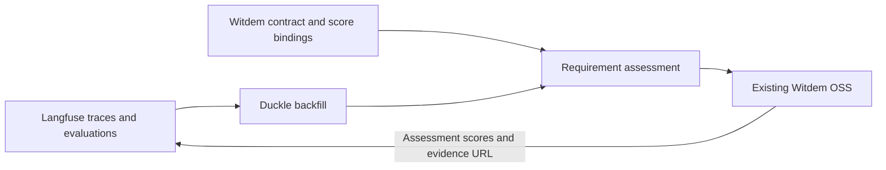

# Witdem for Langfuse

[Website](https://witdem.com/en) · [Witdem documentation](https://docs.witdem.com/) · [Witdem OSS](https://github.com/ebrahimisoheil/witdem-oss) · [Integration guide](docs/README.md) · [Run the example](examples/cuad-evaluations/README.md)

Understand whether an AI execution met your declared requirements, using the evaluations you already store in Langfuse.

This repository is the Langfuse integration for [Witdem](https://witdem.com/en), an open-source application for understanding AI execution outcomes and their evidence.

The integration is currently experimental: Langfuse supplies traces and evaluations; Witdem YAML contracts give those evaluations requirement names, targets, and failure explanations. Results appear in the existing Witdem OSS application, with source references in exported evidence. Neither application's source code or UI needs to change.

## How it works

Langfuse remains the source of traces and evaluations. The integration reads those existing evaluations, applies the requirements your team declared, and delivers the assessment to Witdem OSS.



1. **Declare the requirements.** Use the existing [Witdem YAML contract format](https://docs.witdem.com/contract-tutorial/) for goal names, targets, and failure explanations.
2. **Bind the evidence.** An integration-owned YAML file selects each Langfuse score by identity, source, and subject. This binding file belongs to this adapter; it is separate from Witdem's contract schema.
3. **Import and assess.** Operator-triggered Duckle backfills import historical observations and scores. Numeric or Boolean checks produce met, failed, or unknown requirements without rerunning judges.
4. **Review in Witdem.** Existing [workflow replay](https://docs.witdem.com/workflow-replay/) and [evidence exports](https://docs.witdem.com/evidence-bundles/) present the execution, requirement results, and source references. Application disposition stays separate.
5. **Link back to Langfuse.** The existing scores API receives the contract assessment and an evidence URL for navigation and correlation.

## Start here

| You want to… | Read |
| --- | --- |
| Understand Witdem | [Website](https://witdem.com/en) and [OSS repository](https://github.com/ebrahimisoheil/witdem-oss) |
| Install the existing Witdem application | [Official getting-started guide](https://docs.witdem.com/getting-started/) |
| Run this integration | [CUAD walkthrough](examples/cuad-evaluations/README.md) |
| Understand contracts and score bindings | [Contract tutorial](https://docs.witdem.com/contract-tutorial/) and [example bindings](examples/cuad-evaluations/README.md#the-yaml-bridge) |
| Inspect implementation and public interfaces | [Integration documentation](docs/README.md) |

## Example: CUAD contract review

Goal: **Review meets the declared evidence-quality requirements.**

| Requirement | Existing evaluation | Target |
| --- | --- | --- |
| Findings have sufficient supporting evidence | Evidence completeness | ≥ 0.80 |
| Extraction meets the declared confidence target | Extraction confidence | ≥ 0.70 |

A real review passed with values 1.0 and 0.9. Clearly labeled synthetic fixtures demonstrate a failed threshold and missing evaluation. Application approval, rejection, or escalation stays separate: meeting these checks does not establish legal approval or overall business success.

**[Run the example](examples/cuad-evaluations/README.md)** · [YAML contract](examples/cuad-evaluations/contract.yaml) · [Integration proposal](docs/upstream.md)

## What the adapter does

- Imports bounded historical traces and scores through public Langfuse APIs and Duckle.
- Binds scores by configured identity, source, and trace/observation scope.
- Applies Boolean checks and numeric thresholds; missing or ambiguous evidence remains unknown.
- Preserves score IDs, values, comments, subjects, and original trace references.
- Resumes interrupted imports with stable identities and reassesses saved evaluations without agent or judge calls.
- Returns a narrow contract assessment and evidence URL through the existing scores API, excluding those returned scores from its inputs.

## Deploy a headless job

Run a bounded historical job in a Linux container with persistent checkpoints, shared request pacing, resource limits, and structured progress logs. Finished jobs exit; interrupted jobs resume from the same state volume.

[Deployment guide](docs/deployment.md) · [Measured benchmark](docs/benchmark-results.md) · [Reproduce it](benchmarks/README.md)

## Install and test

Python 3.12+ and uv are required. The connected example additionally requires Langfuse and Witdem OSS; the CUAD runner requires its separately installed application and provider configuration.

```sh
git clone https://github.com/Kaufman-AIS/witdem-langfuse.git
cd witdem-langfuse
uv venv .venv --python 3.12
uv pip install --python .venv/bin/python -e '.[etl,telemetry,contracts,dev]'
export DUCKLE_EXECUTABLE="$PWD/.venv/bin/duckle"
.venv/bin/python -m unittest discover -s tests -q
```

[Backfill reference](docs/backfills.md) · [Explicit record replay](docs/business-record-replay.md) · [Score writeback](docs/score-writeback.md)

## Status and limits

Duckle is pinned to 0.7.2; see the [upgrade verification](docs/benchmark-results.md#duckle-072-upgrade-verification). The original live example used Langfuse 4.35.0, Witdem OSS 0.2.11, Witdem SDK 0.2.3, and Duckle 0.5.11. The large-volume benchmark also used 0.5.11. This is an operator-triggered alpha, not a production compatibility guarantee. No automatic scheduling, new evaluators, dashboards, or contract-version comparisons are included.

The existing UI's unknown-result labels and narrower-goal presentation limitations are documented in the example. Evidence links require destination access. Private runtime data, credentials, and local recordings are excluded; the verifier generates a terminal walkthrough from your own run. No Langfuse endorsement is implied.

Licensed under [Apache-2.0](LICENSE).
