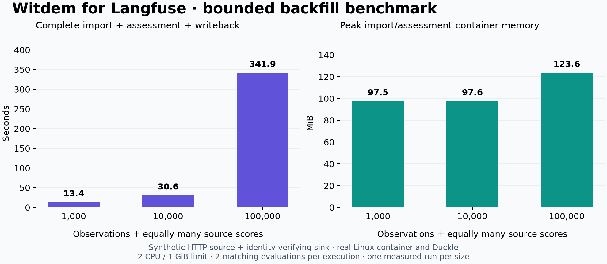

# Deployment benchmark

[Deploy a job](deployment.md) · [Reproduce these measurements](../benchmarks/README.md)

Measured on 14 September 2026. The integration runs headlessly in a Linux
container, checkpoints on persistent storage, and resumes a finite job. These
measurements characterize a single worker; they do not establish cloud capacity
or a production throughput guarantee.

| Observations / source scores | Total time | Observations/s | Peak memory | State on disk |
| --- | ---: | ---: | ---: | ---: |
| 1,000 / 1,000 | 13.4 s | 74.5 | 97.5 MiB | 0.77 MiB |
| 10,000 / 10,000 | 30.6 s | 326.7 | 97.6 MiB | 3.35 MiB |
| 100,000 / 100,000 | 341.9 s | 292.4 | 123.6 MiB | 29.42 MiB |

Measured container image: `sha256:58146178659904f2a6d790169a2e4916a27647a213b6d3fc46ae8d6cf186ee51`.

[Raw baseline](../benchmarks/results/baseline.json) · [Fault test](../benchmarks/results/faults.json) · [Environment](../benchmarks/results/environment.json) · [Real-service checks](../benchmarks/results/real-service.json)

## What was measured

Each case contains one synthetic execution with equally many observations and
source scores. Two scores match the CUAD YAML requirements; the remaining scores
are unrelated diagnostics. The actual integration and Duckle import the
observations, persist the score snapshot, assess the two requirements, and return
three scores. A SQLite sink rejects changed bodies for an existing identity.

Wall time includes container startup, import, assessment, and writeback. Memory
is the import/assessment container's Linux cgroup peak, including child processes
and charged cache; it excludes the separate writeback container and host fixture.
The completed-job restart check happens outside the measured interval and must
make no further requests. Each case produces exactly N unique spans, seven
semantic records, and three returned scores.

The host is an Apple M3 Pro running Docker Desktop 27.5.1, Linux aarch64 kernel
6.12.5-linuxkit. The Docker VM has 11 CPUs and approximately 9.7 GiB memory; the
worker is capped at **2 CPUs, 1 GiB, and 128 processes**. Source and destination
fixtures run outside that cap. Versions: Python 3.12, Duckle 0.5.11, Witdem SDK
0.2.3. Dependency pins are in [the image lockfile](../deploy/requirements.lock).

The synthetic allowance is 60,000 requests/minute to avoid an artificial quota
bottleneck. Deployment defaults to 30, shared per endpoint origin within job
state. Real API quotas, payload sizes, network latency, and destination ingestion
capacity will change throughput. This is one measured run per size on a shared
development host, not a statistical comparison or a benchmark of Langfuse itself.

For capacity planning, 100,000 scores at 100 scores/page require 1,000 reads.
At the default 30 requests/minute that is about 33 minutes for score reads alone,
before observation reads, retries, and other work sharing the source allowance.

## Recovery and downstream checks

The 1,000-observation fault run injects:

- 429 responses on observations and score reads.
- 503 responses on OTLP delivery, semantic delivery, and score writeback.
- A lost acknowledgement after data was persisted.
- A SIGKILL followed by a restart using the same state.
- A competing container using that state, which must exit with code 3.

All checks passed with exactly 1,000 spans, seven semantic records, and three
returned scores. First retries on the five HTTP routes waited at least one second,
as requested by the fixture. Rerunning a completed job made no requests.

The ownership test uses a Linux-owned Docker named volume, matching deployment.
Docker Desktop's shared macOS bind mount did **not** enforce cross-container
file locks in the initial test. It is unsupported for job ownership; use the
provided named volume or a Linux filesystem with working process locks. The
performance baseline uses a host bind mount, so its timings are not measurements
of the named-volume configuration.

The synthetic source was also forwarded through the actual OSS receiver at
1,000 and 10,000 observations. Import, assessment, and synthetic writeback took
17.7 and 76.0 seconds respectively. The dashboard API subsequently confirmed the
exact operation counts, two passing requirements with matching score references,
and four total evaluations in both executions.

The dashboard returned 503 “data is busy” responses while the OSS worker processed
the import. Verification waited for the projection after ingestion; its wait time
is not an ingestion-latency measurement. Destination processing is a separate
capacity constraint. No OSS source code was changed.

[Ingestion measurements](../benchmarks/results/oss-ingestion.json) ·
[Projected-count checks](../benchmarks/results/oss-projection.json)

A separate real-service check reused an existing Haystack CUAD execution from
Langfuse 4.35.0 and delivered it to unchanged Witdem OSS 0.2.11. The dashboard API
confirmed **66 operations, two passing requirements, and four evaluations**.
Each requirement's score reference matched the saved source evidence. Application
status remained `approved_with_exceptions`. Three assessment scores were written
back and read from Langfuse's public scores API. No new agent or judge calls were
made. This verifies compatibility with those local service versions, not a cloud
deployment or arbitrary production data.

The automated suite also passes 39 checks covering selection semantics, missing
and ambiguous evidence, checkpointing, response bounds, and retry behavior.

## Capacity boundary

Score snapshots grow on disk while the assessment retains only matching evidence.
HTTP bodies are capped at 16 MiB; matching evidence is capped at 1,000 scores and
8 MiB and fails explicitly when exceeded. The workload tests a large execution
and score snapshot; it does not test 100,000 independent contract assessments,
large individual score payloads, distributed workers, or concurrent jobs.

The next deployment step is one Linux host using the documented container and
persistent volume, with request limits set for the actual services. Horizontal
scaling and recurring scheduling are outside this implementation.
