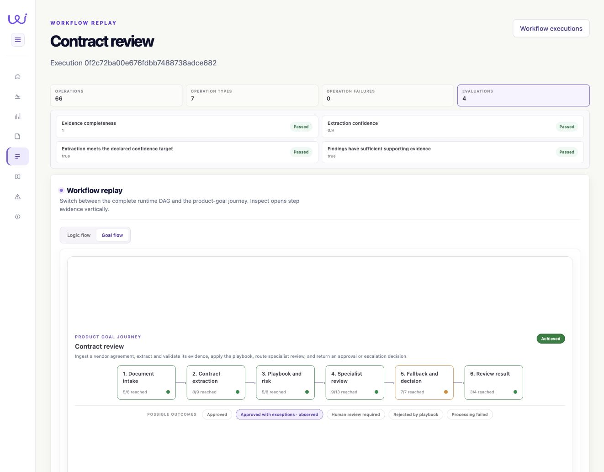
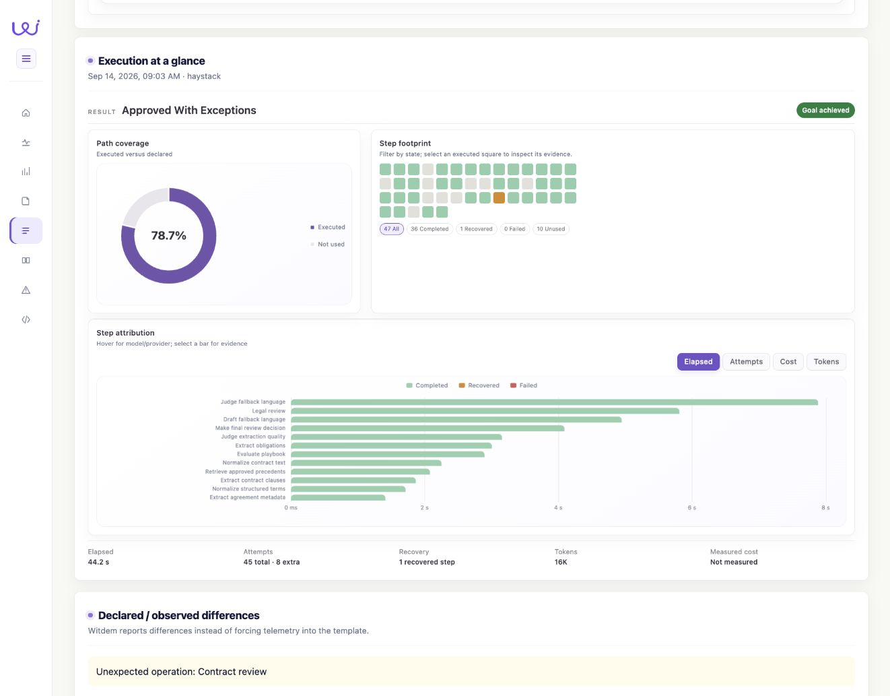
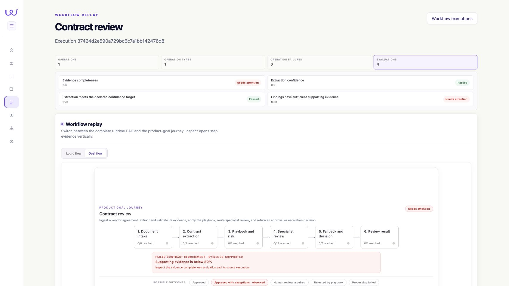

# Screenshot gallery

[Repository home](../README.md) · [Run the CUAD example](../examples/cuad-evaluations/README.md)

Captured on 14 September 2026 from the existing Witdem OSS 0.2.11 demo.
These are direct browser screenshots. No UI elements or assessment values were
redrawn or changed for the images. The application source was not modified.

## Real execution: evaluations and requirements

Open the real imported execution, select **Goal flow**, then expand **Evaluations**.
The two original evaluations and two derived requirement checks appear together.
The workflow heading is “Contract review”; the integration's narrower declared
goal is “Review meets the declared evidence-quality requirements.” Source score
IDs and Langfuse trace references remain available through the example's evidence
export; this screenshot does not show those references.

## Real execution: operational context

Scroll to **Execution at a glance** for the same real execution. The coverage,
recovery, and timing views describe its execution, while the application disposition
remains separate from the requirement assessment. The visible “Unexpected operation:
Contract review” warning is an existing template/telemetry difference, preserved
in the screenshot.

## Synthetic fixture: failed evidence-quality threshold

Open the example's **failed** execution, select **Goal flow**, and expand
**Evaluations**. This is deliberately synthetic: one fixture operation, existing
score-shaped evidence, and no new agent or judge calls. The workflow diagram is
copied context and does not represent executed steps. The requirement fails at
0.6 against the declared 0.8 target. It does not change the separately supplied
application disposition.

Click any screenshot to inspect it at full resolution. The source data and
capture steps are provided by the runnable example; local service URLs are not
public demo links. Refresh screenshots when the verified UI or example changes,
and keep real runs and synthetic fixtures explicitly distinguished.
